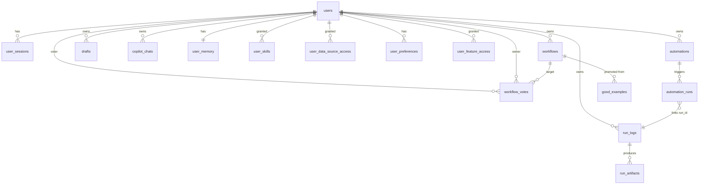

# dbSherpa — Table relations (schema v5)

Logical relationships between the 16 persistence tables. Only **one** SQL foreign key is declared in DDL (`automation_runs.automation_id → automations.id`); all other links are enforced in application code via `user_id` scoping and join keys.

---

## Entity-relationship overview



---

## Auth & identity

### `users`

Root identity table. Every scoped resource carries a `user_id` matching `users.user_id`.

| Column | Notes |
|--------|-------|
| `user_id` | PK — stable internal id (e.g. `user_johndoe`) |
| `username` | Unique login handle |
| `email` | Unique; used for email/password auth |
| `role` | `user` (default) or `admin` |
| `password_hash` | Bcrypt; NULL for OAuth-only |
| `auth_provider` | `email`, `google`, etc. |

**Relations:** parent of all `user_id` columns below.

### `user_sessions`

| Column | Logical FK |
|--------|--------------|
| `session_token` | PK — cookie / bearer value |
| `user_id` | → `users.user_id` |

Sessions expire (default 7 days). Deleted on logout.

---

## Per-user workspace

### `workflows`

Saved workflow library rows, **one namespace per user**.

| Key | |
|-----|--|
| PK | `(user_id, filename)` |

| Column | Notes |
|--------|-------|
| `workflow_data` | Full workflow JSON |
| `upvote_count` / `downvote_count` | Aggregates from `workflow_votes` |

**Relations:**
- `user_id` → `users`
- Referenced by `workflow_votes` (as owner), `automations.workflow_filename` (same user's file), `good_examples` (source)

### `drafts`

Unpublished workflow edits. Same shape as `workflows`, separate table so saves don't overwrite library entries.

| Key | |
|-----|--|
| PK | `(user_id, filename)` |

### `workflow_votes`

Per-user up/down votes on another user's workflow.

| Key | |
|-----|--|
| PK | `(voter_user_id, owner_user_id, filename)` |

| Column | Logical FK |
|--------|--------------|
| `voter_user_id` | → `users` (who voted) |
| `owner_user_id` + `filename` | → `workflows(user_id, filename)` |
| `vote` | `up` or `down` |

### `good_examples`

Promoted workflows copied into the shared examples pool (folder + optional table row).

| Column | Logical FK |
|--------|--------------|
| `source_user_id` + `source_filename` | Origin `workflows` row |
| `promote_to_folder` / `promote_to_table` | Where copies land |
| `folder_path` | Disk path when promoted to folder |

Not multi-tenant shared ownership — promotion is a snapshot, not a live link.

---

## Copilot & memory

### `copilot_chats`

Sherpa Build/Ask thread history.

| Key | |
|-----|--|
| PK | `session_id` |

| Column | Notes |
|--------|-------|
| `user_id` | → `users` (owner) |
| `messages` | JSON array of `{role, content, timestamp, ...}` |

### `user_memory`

Long-lived Sherpa memory markdown per user.

| Key | |
|-----|--|
| PK | `user_id` → `users` |

---

## Access control (admin-managed)

These tables gate what a non-admin user can see. Admins bypass feature checks in `feature_guard()`.

### `user_data_source_access`

Per-connector grants for `connectors/` data sources.

| Key | |
|-----|--|
| PK | `(user_id, source_id)` |

| Column | Notes |
|--------|-------|
| `source_id` | Connector id from registry |
| `has_access` | 1 = allowed, 0 = denied |

No row → default deny for non-admins (admin sees all).

### `user_skills`

Per-skill grants for `backend/skills/*.md`.

| Key | |
|-----|--|
| PK | `(user_id, skill_id)` |

| Column | Notes |
|--------|-------|
| `is_owner` | 1 if user created/uploaded the skill |

### `user_feature_access`

Coarse Studio feature toggles. Keys match `USER_FEATURES` in `user_scope.py`:

| `feature_key` | UI area |
|---------------|---------|
| `workflows` | Workflows & drafts |
| `run_history` | Run history drawer |
| `data_sources` | Data sources drawer |
| `skills` | Skills library |
| `node_palette` | Node palette / templates |
| `automations` | Automations drawer |

| Key | |
|-----|--|
| PK | `(user_id, feature_key)` |

Missing row → feature enabled (opt-out model).

### `user_preferences`

Key-value settings per user.

| Key | |
|-----|--|
| PK | `(user_id, pref_key)` |

Notable keys: `good_example_promote_folder`, `good_example_promote_table`.

---

## Run history

### `run_logs`

One row per workflow execution.

| Key | |
|-----|--|
| PK | `run_id` |

| Column | Logical FK / notes |
|--------|------------------|
| `user_id` | → `users` (who ran it) |
| `workflow` | Display name |
| `status` | `ok` / `error` |
| `disposition` | COMPLETED, ESCALATE, etc. |
| `run_log` | JSON per-node frames |
| `run_result` | JSON workflow result |
| `run_error` | Terminal error text |

### `run_artifacts`

Files produced during a run (CSV, Excel, reports).

| Key | |
|-----|--|
| PK | `id` (auto-increment) |
| Unique | `(run_id, source_node_id, file_name, download_url)` |

| Column | Logical FK |
|--------|--------------|
| `run_id` | → `run_logs.run_id` |

---

## Automations

### `automations`

Scheduled or interval workflow jobs.

| Key | |
|-----|--|
| PK | `id` |

| Column | Logical FK / notes |
|--------|------------------|
| `user_id` | → `users` |
| `workflow_filename` | File in that user's `workflows` table |
| `schedule_type` | `cron` or `interval` |
| `active` | 1 = scheduler picks it up |

### `automation_runs`

Execution log for automations. **Only declared FK in schema:**

```
automation_runs.automation_id → automations.id ON DELETE CASCADE
```

| Column | Logical FK |
|--------|--------------|
| `run_id` | → `run_logs.run_id` (same execution record) |
| `download_url` | Report link if generated |

---

## What is NOT in SQL

| Resource | Storage |
|----------|---------|
| Audit trail | `backend/audit_logs.jsonl` (append-only file) |
| Demo surveillance DB | `backend/demo_data/surveillance_fixture.sqlite` (workflow nodes only) |
| Skill markdown files | `backend/skills/*.md` (DB only tracks grants) |
| Good example JSON on disk | `backend/good_examples/studio_*.json` |

---

## Indexes (MySQL)

Performance indexes are defined in `001_schema_mysql.sql`:

- `users`: `username`, `email`, `role`
- `workflows` / `drafts`: `(user_id, updated_at)`
- `copilot_chats`: `(user_id, updated_at)`
- `run_logs`: `(user_id, started_at)`, `status`
- `run_artifacts`: `run_id`
- `automations`: `user_id`, `active`
- `automation_runs`: `automation_id`, `run_id`

SQLite uses PK/unique constraints only; adequate for local dev volume.

---

## Schema evolution

Runtime migrations live in `backend/app/database_scope.py` (`apply_user_scope_schema`). `init_db()` calls this on every startup so older DB files gain new columns/tables idempotently.

For **greenfield Cloud SQL**, apply `001_schema_mysql.sql` then start the API — migrations are no-ops when schema is already current.
