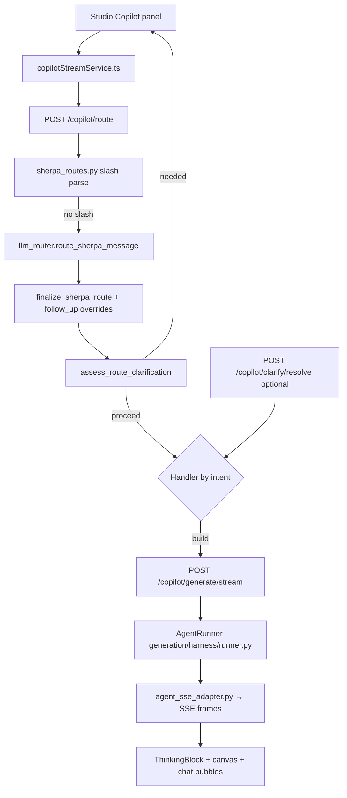

# Sherpa Agent Harness

> End-to-end reference for how **Sherpa (Copilot)** turns chat into workflows, runs, and answers — from the Studio UI through routing, clarification, follow-ups, and the **generation harness** (`backend/generation/`).
>
> **Onboarding (full decision map):** [sherpa-agent-harness-onboarding.md](./sherpa-agent-harness-onboarding.md) — intent layer, plan modal, activity chips, API/handler matrix, metadata dictionary, debugging.  
> **Primary HTTP build entry:** `POST /api/copilot/generate/stream`  
> **Primary route entry:** `POST /api/copilot/route`  
> **Harness metrics:** `GET /api/agent/metrics`

This document replaces the older “generation-only” harness guide. It records **every major layer**, **decision point**, and **behavior change** from the Sherpa routing / clarification / sample-run work (including fixes for silent UI dead-ends).

---

## 1. System map

Sherpa is not a single loop. It is a **stack of gates** before any handler runs:



**Package split (canonical imports):**

| Area | Path | Role |
|------|------|------|
| Routing & thread | `backend/copilot/` | LLM router, slash routes, clarification, follow-up, next-step footers |
| Workflow generation | `backend/generation/` | `AgentRunner`, planner, repair, guardrails |
| HTTP surface | `backend/app/routers/copilot.py` | `/route`, `/generate/stream`, `/clarify/resolve`, chats |
| Studio client | `frontend/src/services/copilotStreamService.ts` | Send pipeline, stream UI state, handler dispatch |
| UI | `frontend/src/components/Copilot/` | Chat, thinking timeline, clarification panel, route chips |

---

## 2. Layer 0 — Studio UI (`frontend/src/components/Copilot/`)

| Component | Responsibility |
|-----------|----------------|
| `index.tsx` | Chat layout, history, `send()` → `runCopilotSend()`, thinking/stream display |
| `CopilotChatInput.tsx` | Input, `\` slash menu, automate schedule modal, draft auto-send |
| `ThinkingBlock` / `AgentChrome.tsx` | “Understanding context…”, step timeline, thought monologue |
| `SherpaClarificationPanel.tsx` | Questions UI (confirm / choice, A–D badges, Continue / Skip) |
| `SherpaRouteChips.tsx` | Contextual `/run`, `/improve`, etc. after build or run |
| `SherpaSlashMenu.tsx` | Explicit slash commands in the input |
| `copilotUtils.ts` | Thread helpers, sample-run offer detection, action acceptance |

**Decision:** Copilot stream state lives in **Zustand** (`workflow/copilotStreamSlice.ts`), not React local state, so generation survives panel unmount and matches the activity rail.

**Decision:** `send()` must **not** silently return when blocked. It now toasts if Sherpa is still busy and **clears stale `copilotPendingClarification`** when the user types a new message (new intent overrides an old Questions gate).

---

## 3. Layer 1 — Client send pipeline (`copilotStreamService.ts`)

### 3.1 `runCopilotSend(msg)` sequence

1. **Guard** — If `copilotStreamActive` and an abort controller exists → toast and return. If active flag is stuck without a live request → `endStreamUi()` and continue (recovery).
2. **Append user bubble** — `addCopilotMessage({ role: 'user', … })`.
3. **Thread** — `buildThreadMessages(copilotMessages)` sent on every `/route` and stream call.
4. **Sample-run fast path** (decision, see §6) — When `looksLikeActionAcceptance(msg)` and `lastAssistantOfferedSampleRun(thread)` and canvas has nodes → **skip `/route`** and synthesize the same metadata as `/run` (`wants_sample_run: true`).
5. **`beginStreamUi()`** — Sets `copilotStreamActive`, clears **pending clarification** for the new turn, resets **stream surface only** (see §3.3).
6. **`POST /copilot/route`** (unless fast path).
7. **Clarification gate** — If `route.clarification.needed` → set `copilotPendingClarification`, post assistant message with the question, `endStreamUi()`, return (panel + bubble).
8. **`continueAfterRoute(route)`** — Dispatches by `route.intent` (§8).
9. **`finally`** — `endStreamUi()`, `clearStreamUiAfterMessage()`, optional canvas focus.

### 3.2 Stream surface vs clarification state (critical fix)

**Bug we fixed:** `clearStreamUiAfterMessage()` used to call `resetCopilotStreamUi()`, which also cleared `copilotPendingClarification`. The UI showed “Understanding context…” then **nothing** — the Questions panel was wiped immediately.

**Decision:**

| API | Clears |
|-----|--------|
| `resetCopilotStreamSurface()` | Thinking steps, stream text, `copilotStreamActive`, route label — **not** pending clarification |
| `resetCopilotStreamUi()` | Full reset including pending clarification (new chat / explicit reset) |
| `beginStreamUi()` | Clears pending clarification **for a new user message**, then `resetCopilotStreamSurface()` |

### 3.3 Thinking visibility

**Decision:** Show the activity block whenever `isLoading` is true, without requiring `copilotActiveRoute` to be set first. During `/route`, the client sets `copilotActiveRoute: 'build'` early so “Understanding context…” appears during routing.

---

## 4. Layer 2 — HTTP API (`backend/app/routers/copilot.py`)

| Endpoint | Purpose |
|----------|---------|
| `POST /copilot/route` | Alias of `/classify` — structured route + optional `clarification` payload |
| `POST /copilot/clarify/resolve` | Apply Questions answer → executable route (`skip_clarification` on response) |
| `POST /copilot/generate/stream` | Build / edit workflow (SSE) |
| `POST /copilot/chat` | Ask-mode chat (blocking); stream variant used from client for Ask |
| `POST /copilot/explain-run/stream` | Post-run analysis |
| `POST /copilot/load/stream` | Load saved workflow by name |
| `POST /copilot/automate/stream` | Schedule / automation setup |
| `POST /copilot/resolve-context` | Resolve workflow + run_log for explain/build from metadata |
| `GET /copilot/routes` | Slash route catalog for chips + menu |
| `GET/POST /copilot/chats/*` | Persisted threads (`copilot_chats.db`) |

**Thread hydration:** `_resolve_thread_context()` calls `WorkflowCopilot.resolve_session_thread()` → `copilot/thread_context.py` (`resolve_thread_history`).

---

## 5. Layer 3 — Slash routes (`copilot/sherpa_routes.py`)

Parsed **before** the LLM router when the message matches `^/([a-z][-a-z0-9]*)\s*(.*)$`.

| Slash | Intent | Default metadata | When shown (context) |
|-------|--------|------------------|----------------------|
| `/build` | `build` | — | always |
| `/ask` | `ask` | — | always |
| `/run` | `ask` | `wants_sample_run: true` | has workflow / after build / after run |
| `/check-run` | `explain_run` | `run_selector: current` | has run log |
| `/improve` | `build` | `edit_existing_workflow: true` | has workflow |
| `/follow-up` | `build` | edit-friendly | has workflow |
| `/automate` | `automate` | — | always |
| `/load` | `load` | — | always |

**Decision:** `/run` uses intent `ask` + `wants_sample_run` (not `build`) so the client executes the canvas DAG with sample payload instead of regenerating the graph.

**Decision:** Slash routes set `metadata.slash_route` so the clarification layer **never** re-prompts on explicit commands.

---

## 6. Layer 4 — LLM router (`copilot/llm_router.py`)

### 6.1 `route_sherpa_message()`

1. Empty → `ask` heuristic.
2. **`route_message_with_slash()`** — if matched, return after `finalize_sherpa_route()`.
3. If no `GEMINI_API_KEY` → `_heuristic_route()` (keyword rules).
4. Else Gemini JSON route via `_ROUTE_SYSTEM` (intents: `build`, `ask`, `automate`, `load`, `explain_run`, `explain_error`, `query_run_data`).

### 6.2 `finalize_sherpa_route()` — post-LLM decision chain

Applied to **every** route (slash, heuristic, or LLM):

| Step | Module | Decision |
|------|--------|----------|
| 1 | `enrich_route_metadata_for_follow_up` | `edit_existing_workflow`, workflow name from canvas/thread |
| 2 | `repair_follow_up_text` | Expand vague “do it” into concrete edit text when editing |
| 3 | `_coalesce_run_output_intent` | `query_run_data` without SQL → `explain_run` when message is run-output shaped |
| 4 | `action_follow_up_outlook_unavailable_override` | Outlook requested but integration locked → safe fallback |
| 5 | `action_follow_up_run_override` | **“yes” / “eys” after sample-run offer** → `intent=ask`, `wants_sample_run=true` |
| 6 | `action_follow_up_build_override` | **“do it” after canvas edit offer** → `intent=build`, expanded `enhanced_question` |

**Decision:** Sample-run acceptance is resolved on the **server** in `follow_up_run` even when the LLM router returns `build` for a short “yes”.

### 6.3 Client sample-run parity

**Decision:** Even with correct server routing, the client **also** short-circuits to `/run` metadata when:

- `looksLikeActionAcceptance(msg)` (includes typos: `eys`, `yse`, `yep`, …), and  
- `lastAssistantOfferedSampleRun(thread)` (regex on last assistant tail), and  
- Canvas has ≥1 node.

This avoids an extra `/route` round-trip and matches slash `/run` when Gemini quota or clarify LLM misbehaves.

---

## 7. Layer 5 — Intent clarification (`copilot/intent_clarification.py`)

Runs inside `_classify_response_from_result()` after routing unless `skip_clarification` (resolve endpoint).

### 7.1 Two-stage assess

1. **`_heuristic_assess()`** — fast, deterministic.
2. **`assess_route_clarification()` LLM** — only if heuristic returns `None` and Gemini is configured.

### 7.2 Heuristic decision table

| Condition | `needed` | Kind |
|-----------|----------|------|
| `clarification_resolved` or `source` starts with `clarification_` | false | — |
| `slash_route` | false | — |
| `wants_sample_run` | false | **Do not confirm again** — same as `/run` |
| “yes” + sample-run next step in thread | false | Proceed like `/run` |
| “yes” with **no** next-step footer | true | `confirm` — ambiguous affirmation |
| `load` without canvas workflow | true | `confirm` — load replaces canvas |
| `query_run_data` + word “sql” | true | `choice` — metadata vs output rows vs both |
| Long `build` request (>80 chars, not acceptance) | defer | LLM may still ask |

### 7.3 Post-heuristic guards (decisions from debugging)

Even when heuristics defer to the clarify LLM:

| Guard | `needed` | Rationale |
|-------|----------|-----------|
| `metadata.wants_sample_run` | false | LLM must not re-gate sample run |
| `intent == build` | false | Explicit pipeline requests go straight to harness |
| “yes” + `is_sample_run_next_step` | false | Affirmative to offer ≡ `/run` |

**Decision we reversed:** An extra “Just to confirm — sample run?” confirm step after “yes” caused dead-ends and user expectation mismatch (**yes must equal `/run`**). Confirmation remains only for **ambiguous** affirmations and **load/SQL** choice cases.

### 7.4 `resolve_clarification_selection()`

| Selection | Effect |
|-----------|--------|
| `yes` (confirm) | Sets `clarification_resolved`, preserves `wants_sample_run` when pending route had it |
| `no` | Downgrade to `ask`, `wants_sample_run: false` |
| `other` + text | Re-route as new user message |
| `a` / `b` / `c` (choice) | Maps to SQL layer metadata |

Frontend: `resolveSherpaClarification()` → `POST /clarify/resolve` → `continueAfterRoute()`.

---

## 8. Layer 6 — Next step & follow-up (`next_action.py`, `follow_up.py`)

### 8.1 Next-step footer contract

Assistant replies should end with:

```markdown
**Next step:** <imperative action>.
<Short question ending with ?>
```

`ensure_build_next_action_footer()` appends sample-run offer after builds when appropriate.

**Decision:** Server build summaries must include the footer (`workflow_generator._generation_turn_summary`) so thread routing sees the offer even when the server history was shorter than the UI copy.

### 8.2 Thread preference (`thread_context.py`)

When the client sends `thread_messages`:

- Prefer client thread if it has **`**Next step:**`** or sample-run offer language and server history does not.
- Prefer client if longer or materially more chars (+80).

**Decision:** Fixes “yes → rebuild” bugs where server stored only `Built Foo (5 nodes)` without the sample-run question.

### 8.3 Action acceptance patterns

Backend: `follow_up.looks_like_action_acceptance`  
Frontend: `copilotUtils.looksLikeActionAcceptance` (kept in sync; includes `eys` typo).

---

## 9. Layer 7 — Handler dispatch (`continueAfterRoute`)

After route + clarification, the client branches:

| Condition | Handler |
|-----------|---------|
| `metadata.wants_sample_run` | `executeSampleRunAndExplain()` — sample payload run + explain stream |
| `intent === ask` | `copilotChatStream` |
| `intent === load` | `copilotLoadStream` |
| `intent === automate` | `copilotAutomateStream` |
| `explain_run` / `query_run_data` with run context | `copilotResolveContext` + `copilotExplainRunStream` |
| default | `copilotGenerateStream` → **AgentRunner** |

**Decision:** Ask handler now always leaves a fallback assistant message if the stream returns empty text (no silent stop).

**Edit mode:** `metadata.edit_existing_workflow` or `shouldEditExistingWorkflow()` passes `current_workflow` into generate stream so the harness edits in place.

---

## 10. Layer 8 — Generation harness (`backend/generation/`)

> **Canonical runner:** `from generation.harness.runner import AgentRunner`  
> **Deprecated:** `copilot/orchestrator_pipeline.py` (reference only; Studio uses `AgentRunner`).

### 10.1 Control loop

```
User scenario (+ optional current_workflow)
        │
        v
┌─────────────────────────────────────────────┐
│  AgentRunner  (generation/harness/runner.py) │
│  1. Intent + enrichment + retriever          │
│  2. Optional parallel pre-tasks              │
│  3. Planner (Gemini) → workflow JSON         │
│  4. Canonicalizer → normalize type IDs       │
│  5. ValidatorAdapter → engine/validator      │
│  6. AutoFixer → deterministic repairs        │
│  7. Repair loop (Planner) if still invalid   │
│  8. finalize_workflow → runtime smoke        │
└─────────────────────────────────────────────┘
        │
        v
  AgentEvent stream → agent_sse_adapter → SSE → Studio UI
```

### 10.2 Key modules

| Module | Role |
|--------|------|
| `harness/runner.py` | Main control loop (`AgentRunner`) |
| `harness/state.py` | `AgentState`, `AgentEvent`, `AgentPhase` |
| `harness/intent.py` | Create vs edit scenario classification |
| `harness/retriever.py` | `good_examples/studio_*.json` + contracts |
| `harness/enrichment.py` | Dataset schemas, skill hints |
| `harness/memory.py` | Structured memory across turns |
| `harness/blueprint_router.py` | Parallel pre-task topology |
| `harness/task_manager.py` | Parallel pre-planning orchestration |
| `harness/compactor.py` | History compaction on token overflow |
| `harness/metrics.py` | `/api/agent/metrics` counters |
| `prompt_builder.py` | System + user + repair prompts |
| `planner.py` | Gemini wrapper |
| `canonicalizer.py` | Type ID normalization |
| `validator_adapter.py` | Bridge to `engine/validator.py` |
| `repair/auto_fixer.py` | Mechanical fixes (edges, bindings, templates) |
| `generation_guardrails.md` | LLM rules (also `GET /copilot/guardrails`) |

### 10.3 Copilot integration points

| Copilot module | Harness tie-in |
|----------------|----------------|
| `workflow_generator.py` | Invokes `AgentRunner`, maps events via `agent_sse_adapter` |
| `agent_sse_adapter.py` | `AgentPhase` → `agent_stage` SSE, contextual plan steps |
| `build_narration.py` | Parallel planning bullets for UI |
| `workflow_finalize.py` | Post-validation smoke (alert sample, MCP check) |
| `progress_narration.py` | Human-readable stage titles |

### 10.4 Repair pipeline

```
LLM output
  → Canonicalizer
  → ValidatorAdapter
  → AutoFixer (no LLM)
  → if invalid: FeedbackBuilder → Planner repair (≤ max_attempts, default 3)
```

### 10.5 Parallel pre-tasks

| Variable | Default | Purpose |
|----------|---------|---------|
| `HARNESS_ENABLE_PARALLEL_TASKS` | `1` | Enable fan-out |
| `HARNESS_PARALLEL_MAX_TASKS` | `4` | Concurrency cap |
| `HARNESS_TASK_TIMEOUT_MS` | `15000` | Per-task timeout |
| `HARNESS_PARALLEL_LLM_SUBAGENTS` | `1` if Gemini configured | LLM planning bullets |
| `HARNESS_PARALLEL_LLM_MAX_OUTPUT_TOKENS` | `280` | Cap per subagent |

---

## 11. Layer 9 — Run analysis & verification (adjacent agents)

| Module | Role |
|--------|------|
| `run_analyst.py` | Streamed run summaries, reliability suggestions, next-step footers |
| `run_verification.py` | Python-side checks (`row_counts`, `join_orphans`) when `verification_plan` set |
| `run_resolver.py` / `sherpa_context.py` | Pick workflow + run_id from metadata |
| `run_output_questions.py` | Detect run-output questions for routing |
| `workflow_blueprints.py` | Blueprint hints for generation |
| `improvement_acceptance.py` | Structured improve specs from thread |

**Decision:** Router may set `verification_plan` + `wants_sql` for explain_run; actual SQL on output is optional follow-up, not required for every count question.

---

## 12. Layer 10 — Thinking & narration SSE

| Event (SSE) | UI effect |
|-------------|-----------|
| `agent_stage` | Thinking step rows, monologue, subagent labels |
| `thinking` | Pulse steps |
| `text_chunk` / `text_start` | Streaming assistant text in panel |
| `workflow_created` | Canvas load + compact layout |
| `agent_final_summary` | Collapsed bullet summary |
| `error` | `copilotStreamError` + bubble on completion |

Backend helpers: `thinking_sse.py`, `thinking_monologue.py`, `progress_narration.py`.

Frontend: `thinkingHelpers.ts` merges stages; `useTypewriterText` for reply pacing after monologue completes.

---

## 13. Decision log (summary)

| # | Decision | Why |
|---|----------|-----|
| 1 | Split route vs generate HTTP calls | Route is cheap JSON; generate is long SSE |
| 2 | `finalize_sherpa_route` overrides after LLM | Short “yes”/“do it” must not depend on model luck |
| 3 | Client thread preferred when it has Next step | Server summaries were truncating offers |
| 4 | `yes` ≡ `/run` (no second confirm) | User expectation + fewer Gemini calls |
| 5 | Client fast path for sample-run accept | Parity when `/route` slow or wrong |
| 6 | Clarification skips `build` + `wants_sample_run` | Avoid blocking real work behind Questions |
| 7 | `resetCopilotStreamSurface` ≠ full UI reset | Fixing clarification wiped panel instantly |
| 8 | Assistant bubble when clarification needed | User sees question even if panel scrolled away |
| 9 | Slash routes bypass clarification | Explicit intent |
| 10 | `AgentRunner` replaces orchestrator pipeline for Studio | Single harness in `generation/` (DRY) |
| 11 | MCP / integration locked surfaced in follow-up | Avoid promising Outlook when disabled |
| 12 | Typo tolerance (`eys`) on acceptance | Real user input from keyboard |

---

## 14. Failure modes & operations

| Symptom | Likely cause | What to check |
|---------|--------------|---------------|
| “Understanding context…” then nothing | Clarification cleared by old `resetCopilotStreamUi` in `clearStreamUiAfterMessage` | Fixed in stream surface split; hard-refresh UI |
| “yes” does nothing | Route without `wants_sample_run` + no fast path | Thread must include sample-run offer; client + `follow_up_run` |
| `/run` works but “yes” does not | Client not matching offer regex | `lastAssistantOfferedSampleRun` on assistant tail |
| Build never starts | Gemini 429 on route or generate | Backend logs; `GEMINI_API_KEY`; quota |
| Empty assistant after Ask | Stream returned no chunks | Fallback message in `continueAfterRoute` |
| Stuck spinner | `copilotStreamActive` stuck true | Send again (recovery) or refresh; check aborted fetch |

```bash
curl http://localhost:8001/api/health
curl http://localhost:8001/api/agent/metrics
```

---

## 15. Testing map

| Test file | Covers |
|-----------|--------|
| `tests/test_intent_clarification.py` | Clarify heuristics, resolve, build+yes without gate |
| `tests/test_follow_up.py` | Sample-run yes, footer repair, finalize |
| `tests/test_sherpa_routes.py` | Slash `/run`, metadata |
| `tests/test_thread_context.py` | Client thread with footer preferred |
| `tests/test_llm_router.py` | Route parsing, heuristics |
| `tests/test_harness_intent.py` | Harness intent classification |
| `tests/test_harness_prompt_scenarios.py` | Live Gemini (`-m integration`) |
| `tests/test_studio_workflows_e2e.py` | All `good_examples/` execute |
| `tests/test_agent_sse_adapter.py` | SSE mapping |
| `frontend/.../copilotStreamService.test.ts` | Focus on complete behavior |
| `frontend/.../copilotUtils.test.ts` | Sample-run offer detection |

```bash
cd backend
pytest tests/test_intent_clarification.py tests/test_follow_up.py tests/test_sherpa_routes.py -q
pytest tests/test_studio_workflows_e2e.py -q
pytest tests/test_harness_prompt_scenarios.py -m integration -q   # needs GEMINI_API_KEY
```

---

## 16. Related docs & sources

- [Architecture](./architecture.md) — system diagram, `/run/stream` lifecycle  
- [Frontend Architecture](./frontend-architecture.md) — Zustand slices, Copilot panel  
- [Backend Structure](./backend-structure.md) — package layout  
- [Data Source Onboarding](./data-source-onboarding.md) — datasets in prompts (`enrichment.py`)  
- [Node Catalogue](./node-catalogue.md) — palette types the harness may emit  
- [MCP Integrations](./mcp-integrations.md) — `jira_mcp` / `confluence_mcp` / `github_mcp` credentials and tools  
- `backend/generation/generation_guardrails.md` — LLM rules (source of truth)  
- `backend/skills/skills-agentic-workflow-builder.md` — builder skill  
- `backend/good_examples/studio_*.json` — few-shot demos (15 files)

---

## 17. Quick reference — copilot Python modules

```
backend/copilot/
  llm_router.py           # Structured route + finalize chain
  sherpa_routes.py        # Slash commands + chips catalog
  intent_clarification.py # Questions gate + resolve
  follow_up.py            # yes/do-it overrides, typo repair
  next_action.py          # Next step footer + parsers
  thread_context.py       # Session thread merge rules
  workflow_generator.py   # generate/stream → AgentRunner
  agent_sse_adapter.py    # AgentEvent → Studio SSE
  run_analyst.py          # explain-run streams
  run_verification.py     # Verification plans
  sherpa_context.py       # resolve-context helper
```

```
backend/generation/harness/
  runner.py               # AgentRunner control loop
  state.py                # AgentEvent / AgentPhase
  …
```
