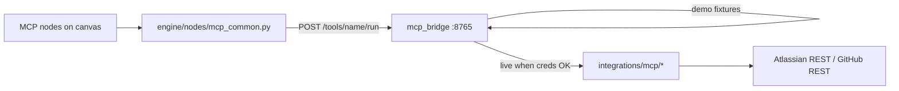

# MCP & Microsoft integrations

> Where **GitHub**, **Jira**, and **Confluence** credentials live, which **HTTP endpoints** and **tools** Studio calls, how to switch **demo vs live**, and the status of **Microsoft Teams** and **Outlook**.
>
> **Related:** [Node Catalogue — Integrations](./node-catalogue.md#mcp-integrations-atlassian--github) · [Sherpa Agent Harness](./generation-harness.md)

---

## 1. Architecture (two layers)

Studio does **not** spawn stdio MCP servers (unlike Hermes/OpenClaw). It uses a **fixed HTTP contract**:



| Layer | Path | Responsibility |
|-------|------|----------------|
| **Workflow nodes** | `engine/nodes/{mcp,jira_mcp,confluence_mcp,github_mcp}.py` | Build request, call bridge, return `rows` |
| **HTTP bridge** | `mcp_bridge/server.py` | FastAPI: `GET /health`, `GET /tools`, `POST /tools/{name}/run` |
| **Bridge router** | `mcp_bridge/tools.py` | Demo handlers + delegate to live when allowed |
| **Live integrations** | `integrations/mcp/{github,jira,confluence}/` | REST clients + tool handlers |
| **Credential resolution** | `integrations/mcp/credentials.py` | Env + request `credentials` payload |
| **Registry** | `integrations/mcp/registry.py` | Which tools have live implementations |

**Decision:** Credentials for MCP are **only read from `backend/.env`** at run time (`mcp_common.credentials_payload`). Workflow JSON and Copilot cannot override tokens (`engine/integration_locked.py` strips locked keys on save).

---

## 2. Where credentials are defined

### 2.1 Primary location: `backend/.env`

Copy from `backend/.env.example` if present, or add:

```env
# --- Atlassian (Jira + Confluence share one Cloud site) ---
ATLASSIAN_SITE_URL=https://yourco.atlassian.net
ATLASSIAN_EMAIL=you@company.com
ATLASSIAN_API_TOKEN=your-atlassian-api-token
CONFLUENCE_SPACE_KEY=MFS
JIRA_PROJECT_KEY=DEMO

# --- GitHub ---
GITHUB_TOKEN=ghp_xxxxxxxx
GITHUB_REPO=owner/repo
# Alternative token name:
# GITHUB_PERSONAL_ACCESS_TOKEN=ghp_xxxxxxxx

# --- MCP bridge (optional overrides) ---
MCP_SERVER_URL=http://127.0.0.1:8765
MCP_BRIDGE_URL=http://127.0.0.1:8765
MCP_BRIDGE_MODE=demo
MCP_BRIDGE_PORT=8765
MCP_BRIDGE_AUTOSTART=1
MCP_HTTP_TIMEOUT=120

# --- Microsoft Teams (not MCP — direct webhook node) ---
TEAMS_INCOMING_WEBHOOK_URL=https://outlook.office.com/webhook/...

# --- Microsoft Outlook (Graph — not wired end-to-end yet) ---
OUTLOOK_TENANT_ID=...
OUTLOOK_CLIENT_ID=...
OUTLOOK_CLIENT_SECRET=...
```

`runtime_env.ensure_env_loaded()` loads `.env` before nodes and the bridge start.

### 2.2 Resolution order (MCP tools)

For each `POST /tools/{tool}/run` call:

1. Node handler builds `credentials` in `mcp_common.credentials_payload()` from **environment only**.
2. Bridge merges `body.credentials` into `params["_credentials"]`.
3. `integrations/mcp/credentials.resolve_atlassian()` / `resolve_github()` read `_credentials.*` first, then fall back to env vars.

| Credential field (request) | Environment variable(s) |
|----------------------------|-------------------------|
| `atlassian.site_url` | `ATLASSIAN_SITE_URL` |
| `atlassian.email` | `ATLASSIAN_EMAIL` |
| `atlassian.api_token` | `ATLASSIAN_API_TOKEN` |
| `atlassian.confluence_space` | `CONFLUENCE_SPACE_KEY` (default `MFS`) |
| `atlassian.jira_project` | `JIRA_PROJECT_KEY` (default `DEMO`) |
| `github.token` | `GITHUB_TOKEN` or `GITHUB_PERSONAL_ACCESS_TOKEN` |
| `github.repo` | `GITHUB_REPO` |

### 2.3 Studio UI (locked inspector fields)

Typed nodes (`jira_mcp`, `confluence_mcp`, `github_mcp`) show **locked_env** params — display-only mirrors of `.env` (secrets masked).

- API: integration defaults come from engine registry + `GET` paths that use `integration_env_defaults_for_ui()` in `engine/integration_locked.py`.
- Frontend: `frontend/src/lib/integrationLocked.ts` prevents editing credential fields on MCP nodes.
- Saving a workflow **strips** locked keys so generated JSON never contains tokens.

**Decision:** Operators rotate secrets in `.env` only; no per-workflow PATs in saved DAGs.

### 2.4 Direct GitHub node (non-MCP)

The **`github`** node (`engine/nodes/github.py`) calls the **GitHub REST API** directly (list issues, push file, etc.). It uses the same env vars:

- `GITHUB_TOKEN` / `GITHUB_PERSONAL_ACCESS_TOKEN`
- `GITHUB_REPO` or `config.repo` (with placeholder rejection via `integration_env.resolve_github_repo()`)

Use **`github_mcp`** when you need bridge tools (`github_list_commits`, `github_fix_jira_and_update`). Use **`github`** for simple REST actions without the bridge.

---

## 3. HTTP endpoints

### 3.1 MCP bridge (default `http://127.0.0.1:8765`)

| Method | Path | Body | Response |
|--------|------|------|----------|
| `GET` | `/health` | — | `{ "status": "ok", "mode": "demo" \| "live" }` |
| `GET` | `/tools` | — | `{ "tools": [{ "name", "description" }, …] }` |
| `POST` | `/tools/{tool_name}/run` | `{ "params": {}, "credentials": { "integration", "atlassian"?, "github"? } }` | `{ "rows", "rowCount", "mode"?, … }` |

**Run manually:**

```bash
cd backend
MCP_BRIDGE_MODE=demo MCP_BRIDGE_PORT=8765 python -m mcp_bridge.server
curl http://127.0.0.1:8765/health
curl http://127.0.0.1:8765/tools
```

### 3.2 Autostart with Studio backend

`app/mcp_lifecycle.py` — when `MCP_BRIDGE_AUTOSTART` is not `0` (default **on**), the FastAPI app spawns `python -m mcp_bridge.server` if `/health` is down.

Set `MCP_BRIDGE_AUTOSTART=0` if you run the bridge yourself or point at a remote gateway.

### 3.3 Engine node → bridge

From `mcp_common.run_mcp_bridge()`:

```http
POST {MCP_SERVER_URL}/tools/{tool}/run
Content-Type: application/json

{
  "params": { "data": [ …upstream rows… ], "title": "…" },
  "credentials": {
    "integration": "atlassian",
    "atlassian": { "site_url", "email", "api_token", "confluence_space", "jira_project" }
  }
}
```

Optional per-node override: `config.serverUrl` (otherwise `MCP_SERVER_URL` → `MCP_BRIDGE_URL` → `http://127.0.0.1:8765`).

---

## 4. Demo vs live mode

| `MCP_BRIDGE_MODE` | Behavior |
|-------------------|----------|
| `demo` (default) | All tools in `mcp_bridge/tools.TOOL_REGISTRY` return **fixtures** (`mcp_bridge/demo_data.py`). No external API calls. |
| anything else (e.g. `live`) | For each tool: if `registry.should_run_live()` and handler exists in `integrations/mcp`, call **live** REST; else **400/RuntimeError** with missing env hints. |

**Live eligibility** (`integrations/mcp/registry.should_run_live`):

- Atlassian tools: `ATLASSIAN_SITE_URL`, `ATLASSIAN_EMAIL`, `ATLASSIAN_API_TOKEN` all non-empty.
- GitHub tools: `GITHUB_TOKEN` (or PAT alias) and `GITHUB_REPO` non-empty.
- Integration hint in credentials must match tool family (Atlassian tools won’t run with `integration: github`).

**How to switch:**

```bash
# Demo (CI, offline demos)
MCP_BRIDGE_MODE=demo

# Live Jira/Confluence/GitHub
MCP_BRIDGE_MODE=live
ATLASSIAN_SITE_URL=...
ATLASSIAN_EMAIL=...
ATLASSIAN_API_TOKEN=...
GITHUB_TOKEN=...
GITHUB_REPO=owner/repo
```

Restart the bridge after changing mode or tokens.

---

## 5. Tool catalog

### 5.1 Confluence

| Tool | Demo (`TOOL_REGISTRY`) | Live (`CONFLUENCE_TOOLS`) | Handler file |
|------|------------------------|---------------------------|--------------|
| `confluence_search_pages` | Yes — fixture pages | No — demo only today | `mcp_bridge/tools.py` |
| `confluence_extract_action_items` | Yes — parses markdown checkboxes | No — demo only | `mcp_bridge/tools.py` |
| `confluence_publish_report` | Yes — fake page URL | Yes — creates/updates page | `integrations/mcp/confluence/tools.py` |
| `studio_publish_architecture_doc` | No | Yes — repo analysis → Confluence | `integrations/mcp/confluence/tools.py` |

**Aliases:** `create_confluence_page`, `confluence_create_page`, `publish_confluence_page` → `confluence_publish_report`.

### 5.2 Jira

| Tool | Demo | Live | Handler file |
|------|------|------|--------------|
| `tasks_bulk_create` | Yes — in-memory task rows | No | `mcp_bridge/tools.py` |
| `jira_create_issue` | Yes — synthetic keys | Yes | `integrations/mcp/jira/tools.py` |
| `jira_list_issues` | Yes — fixture + created | Yes | `integrations/mcp/jira/tools.py` |
| `jira_create_epics_from_confluence` | No* | Yes | `integrations/mcp/jira/tools.py` |

\*Not registered in demo `TOOL_REGISTRY`; use **live** mode with full Atlassian creds.

### 5.3 GitHub

| Tool | Demo | Live | Handler file |
|------|------|------|--------------|
| `github_list_commits` | Yes — fixture commits | Yes | `integrations/mcp/github/tools.py` |
| `github_implement_fixes` | Yes — synthetic PR rows | No — demo only | `mcp_bridge/tools.py` |
| `github_fix_jira_and_update` | No | Yes — branch/PR + Jira comment | `integrations/mcp/github/tools.py` |

**Note:** Node YAML lists `github_implement_fixes` for `github_mcp`; live automation for Jira-linked fixes should prefer `github_fix_jira_and_update` when `MCP_BRIDGE_MODE=live`.

### 5.4 List tools programmatically

```bash
curl -s http://127.0.0.1:8765/tools | python3 -m json.tool
```

Python:

```python
from integrations.mcp.registry import list_tools, get_tool
```

---

## 6. Workflow nodes (canvas)

| type_id | Preferred for | Default tool | Credentials (env) |
|---------|---------------|--------------|-------------------|
| `jira_mcp` | Jira create/list/epics | `jira_create_issue` | `ATLASSIAN_*`, `JIRA_PROJECT_KEY` |
| `confluence_mcp` | Search, extract, publish | `confluence_publish_report` | `ATLASSIAN_*`, `CONFLUENCE_SPACE_KEY` |
| `github_mcp` | Commits, Jira-linked PRs | `github_list_commits` | `GITHUB_TOKEN`, `GITHUB_REPO` |
| `mcp` | **Legacy** — auto-upgrades to typed node on normalize | varies | same |

Specs: `backend/engine/nodes/*_mcp.yaml`  
Shared runner: `backend/engine/nodes/mcp_common.py`  
Tool constants: `backend/engine/mcp_nodes.py`

**Copilot / harness:** Prefer typed `*_mcp` nodes in new workflows (`generation/generation_guardrails.md`). Legacy `mcp` nodes are normalized via `normalize_mcp_workflow()`.

**Example workflows:**

| Path | Chain |
|------|-------|
| `workflows/mcp_integrations/01_confluence_to_tasks.json` | search → extract → `tasks_bulk_create` |
| `workflows/mcp_integrations/02_confluence_to_jira.json` | search → extract → Jira |
| `workflows/mcp_integrations/03_jira_to_github_fixes.json` | Jira → `github_implement_fixes` |
| `workflows/mcp_integrations/live_*.json` | Live-oriented copies |
| `good_examples/studio_01_mcp_ticket_swarm.json` | Demo MCP swarm |
| `good_examples/studio_13_confluence_actions_issue_pipeline.json` | Confluence → Jira pipeline |

---

## 7. How to change behavior

| Goal | What to edit |
|------|----------------|
| Add a new Jira tool | `jira/connectivity.py` (REST) → `jira/tools.py` → register in `JIRA_TOOLS` → add demo handler in `mcp_bridge/tools.py` if demo support needed → `engine/mcp_nodes.py` + YAML enum |
| Add Confluence tool | Same pattern under `confluence/` |
| Add GitHub tool | Same under `github/` |
| Change env var names | `credentials.py`, `integration_locked.MCP_CONFIG_KEY_TO_ENV`, `mcp_common.atlassian_credentials()` |
| Change bridge port | `MCP_BRIDGE_PORT` / `MCP_SERVER_URL` |
| Disable autostart | `MCP_BRIDGE_AUTOSTART=0` |
| Point Studio at remote bridge | `MCP_SERVER_URL=https://your-gateway/tools/...` (must implement same POST contract) |
| Mask tokens in UI | `integration_locked.integration_env_defaults_for_ui()` |

**Tests:**

```bash
cd backend
pytest tests/test_mcp_bridge_tools.py tests/test_mcp_layer_consistency.py tests/test_mcp_integration_workflows.py -q
python -m pytest tests/test_github_mcp_list_commits.py -q   # live GitHub when token set
```

---

## 8. Microsoft Teams (not MCP)

Teams uses the **`teams`** node — **incoming webhook only**, no MCP bridge.

| Item | Status |
|------|--------|
| **Node** | `engine/nodes/teams.py`, `teams.yaml` |
| **Studio palette** | `studio_active: false` — placeholder / manual add; Copilot does not emit by default |
| **Working path** | `deliveryMode: incoming_webhook` (default) + `TEAMS_INCOMING_WEBHOOK_URL` or `config.webhookUrl` |
| **Implementation** | `httpx.post(webhook, json={"text": message})` — **done** for webhook mode |
| **Graph mode** | `deliveryMode: graph` — **not implemented**; raises asking for Azure app creds |
| **Config** | `message`, optional `title`; supports `{{row.field}}` templates from upstream rows |
| **Demo** | `good_examples/studio_11_teams_risk_digest.json` |

**Env:**

```env
TEAMS_INCOMING_WEBHOOK_URL=https://outlook.office.com/webhook/...
```

**How to create webhook:** Teams channel → Connectors → Incoming Webhook → copy URL into `.env`.

### Left to do (Teams)

- [ ] `studio_active: true` when product wants Copilot to suggest Teams nodes routinely  
- [ ] Microsoft Graph channel messaging (`teamId`, `channelId`, app registration)  
- [ ] Adaptive Cards / threaded replies  
- [ ] Shared credential block in UI (like MCP locked_env) for webhook URL  

---

## 9. Microsoft Outlook (not MCP)

Outlook uses the **`outlook`** node — **Microsoft Graph**, not MCP.

| Item | Status |
|------|--------|
| **Node** | `engine/nodes/outlook.py`, `outlook.yaml` |
| **Studio palette** | `studio_active: false` — placeholder; Copilot may mention email but often routes to “configure Outlook” guidance |
| **Credential check** | **Done** — `integration_env.require_outlook()` validates `OUTLOOK_TENANT_ID`, `OUTLOOK_CLIENT_ID`, `OUTLOOK_CLIENT_SECRET` |
| **Send mail** | **Not implemented** — `run()` raises `RuntimeError` after cred check (“wire Graph API next”) |
| **Sherpa** | `follow_up_outlook_unavailable_override` downgrades “remove outlook” requests; `run_analyst` suggests `.env` when user asks for email nodes |

**Env:**

```env
OUTLOOK_TENANT_ID=your-tenant-id
OUTLOOK_CLIENT_ID=your-app-client-id
OUTLOOK_CLIENT_SECRET=your-client-secret
```

Register an app in Azure Portal → API permissions `Mail.Send` (application or delegated, depending on future design).

### Left to do (Outlook)

- [ ] OAuth2 client-credentials or delegated token flow  
- [ ] `POST /users/{id}/sendMail` (or shared mailbox) in `outlook.py`  
- [ ] HTML body + attachment support from upstream rows  
- [ ] `studio_active: true` + generation guardrails for notification workflows  
- [ ] Locked_env inspector fields (parity with MCP nodes)  
- [ ] Integration test with sandbox tenant  

---

## 10. Atlassian Rovo / external MCP servers

Studio’s bridge is **not** the Atlassian Rovo remote MCP server. For CLI agents (Hermes, OpenClaw) you may run:

- `@modelcontextprotocol/server-github` (stdio, `GITHUB_PERSONAL_ACCESS_TOKEN`)
- Community `mcp-atlassian` Docker images

To use those with Studio today, you would need a **gateway** that translates their tools into `POST /tools/{name}/run` — not shipped in-repo.

Optional future env (not wired in `credentials.py` today): `ATLASSIAN_MCP_TOKEN` for OAuth bearer to Rovo — documented in `mcp_bridge/README.md` for external setups only.

---

## 11. Operational checklist

| Step | Action |
|------|--------|
| 1 | Put tokens in `backend/.env` |
| 2 | Set `MCP_BRIDGE_MODE=live` for real Jira/Confluence/GitHub |
| 3 | Confirm `curl http://127.0.0.1:8765/health` |
| 4 | Run a workflow with `confluence_mcp` / `jira_mcp` / `github_mcp` |
| 5 | For Teams alerts, set `TEAMS_INCOMING_WEBHOOK_URL` and use `teams` node |
| 6 | For Outlook, wait for Graph send — only credential validation works now |

**Security:** Never commit `.env`; locked MCP config prevents workflow JSON from storing PATs; rotate `ATLASSIAN_API_TOKEN` and `GITHUB_TOKEN` on the provider side when leaked.

---

## 12. File index

```
backend/
  .env                          # ← credentials (gitignored)
  engine/nodes/
    mcp_common.py               # HTTP client to bridge
    jira_mcp.py / confluence_mcp.py / github_mcp.py
    teams.py / outlook.py       # Microsoft (non-MCP)
  engine/integration_locked.py  # Strip secrets from saved workflows
  engine/mcp_nodes.py           # Tool ↔ node type mapping
  mcp_bridge/
    server.py                   # FastAPI app
    tools.py                    # Demo registry + live dispatch
    demo_data.py                # Fixtures
  integrations/mcp/
    credentials.py
    registry.py
    github/ jira/ confluence/
  app/mcp_lifecycle.py          # Autostart bridge
```
