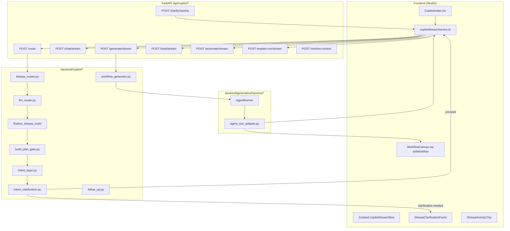

# Sherpa Agent Harness — Engineer Onboarding (Full Decision Map)

> **Audience:** Senior engineers (3+ years) onboarding to dbSherpa Studio Sherpa / Copilot.  
> **Goal:** Know exactly **what runs when**, **which API owns it**, **what the UI does**, and **which metadata flags flip** — without reading the entire repo first.  
> **Companion:** [generation-harness.md](./generation-harness.md) (generation loop depth). [architecture.md](./architecture.md) (system-wide).

---

## 0. How to read this doc

| If you need… | Start at |
|--------------|----------|
| One message’s full path (UI → API → handler) | [§2 Master lifecycle](#2-master-lifecycle-one-user-message) |
| “Why did Sherpa plan vs build vs clarify?” | [§4 Intent layer & disposition](#4-intent-layer--disposition) |
| “Why did a how-to / starter prompt open Questions?” | [§4.5 Advisory / platform Q&A guard](#45-advisory--platform-qa-guard) |
| Plan modal vs Questions panel | [§5 Build plan gate & plan approval UI](#5-build-plan-gate--plan-approval-ui) |
| Activity chip labels (Thinking / Generating / …) | [§6 Activity chip & stream UI state](#6-activity-chip--stream-ui-state) |
| Every HTTP endpoint | [§7 HTTP API reference](#7-http-api-reference) |
| `metadata.*` flags | [§8 Route metadata dictionary](#8-route-metadata-dictionary) |
| Intent → client handler | [§9 Intent → handler dispatch matrix](#9-intent--handler-dispatch-matrix) |
| Generation harness internals | [§10 Generation harness](#10-generation-harness-agentrunner) |
| Tests to run | [§14 Test & regression matrix](#14-test--regression-matrix) |
| Production debugging | [§15 Debugging playbook](#15-debugging-playbook) |

**Primary entry points in code:**

| Layer | Canonical file |
|-------|----------------|
| UI send | `frontend/src/services/copilotStreamService.ts` → `runCopilotSend()` |
| Route API | `backend/app/routers/copilot.py` → `POST /copilot/route` |
| Router | `backend/copilot/llm_router.py` |
| Plan gate | `backend/copilot/build_plan_gate.py` |
| Intent layer | `backend/copilot/intent_layer.py` |
| Clarify | `backend/copilot/intent_clarification.py` |
| Harness | `backend/generation/harness/runner.py` → `AgentRunner` |

---

## 1. System map (responsibility split)



**Division of labor:**

| Concern | Owner |
|---------|--------|
| **What should Sherpa do next?** (intent, disposition, clarify) | Backend: router + intent layer + clarification |
| **When to show Questions vs Plan approval** | Backend sets flags; frontend `copilotStreamService` + `sherpaClarificationTypes` |
| **When canvas updates** | Frontend `handleStreamEvent` on `workflow_created` |
| **When “Generating” appears** | Frontend only when `copilotHarnessGenerating === true` (harness SSE active) |
| **Workflow JSON validity** | Backend `AgentRunner` + validator + repair loop |
| **Thread / session persistence** | `WorkflowCopilot` + `copilot_chats.db`; client sends `thread_messages` every turn |

---

## 2. Master lifecycle (one user message)

### 2.1 Sequence (happy path variants)

```
User types message in CopilotChatInput
        │
        ▼
runCopilotSend(msg)                          [copilotStreamService.ts]
        │
        ├─► Guard: copilotStreamActive? → toast or recover stale flag
        ├─► addCopilotMessage(user)
        ├─► buildThreadMessages(copilotMessages)
        │
        ├─► FAST PATH: sample-run "yes"?
        │     looksLikeActionAcceptance(msg)
        │     && lastAssistantOfferedSampleRun(thread)
        │     && canvas has nodes
        │     → skip /route, synthesize wants_sample_run route
        │
        ├─► beginStreamUi()
        │     copilotStreamActive=true
        │     copilotHarnessGenerating=false
        │     copilotActivityMode='thinking'
        │     resetCopilotStreamSurface()  (NOT full UI reset)
        │     clear copilotPendingClarification for NEW message
        │
        ├─► POST /api/copilot/route         [unless fast path]
        │     Body: message, has_workflow, has_run_log, workflow_name,
        │           thread_messages, current_workflow, session_id, …
        │
        ├─► Seed thinking from route.disposition / thinking_preview
        ├─► patchActivityMode from disposition
        │
        ├─► clarification.needed?
        │     YES → setCopilotPendingClarification (Questions panel)
        │           assistant bubble with question
        │           endStreamUi(), RETURN
        │
        └─► continueAfterRoute(route)        [see §9]
                │
                finally: endStreamUi(), clearStreamUiAfterMessage()
```

### 2.2 Backend `/route` pipeline (single call)

Executed in `copilot_classify()` → `_classify_response_from_result()`:

| Step | Module | Function | Output |
|------|--------|----------|--------|
| 1 | `WorkflowCopilot` | `classify_intent()` → `route_sherpa_message()` | `SherpaRoute` |
| 2 | `sherpa_routes.py` | `route_message_with_slash()` | Forced route if `/slash` |
| 3 | `llm_router.py` | Gemini JSON or `_heuristic_route()` | intent + metadata |
| 4 | `llm_router.py` | `_apply_route_heuristic_overrides()` | named run / load / edit |
| 5 | `llm_router.py` | `finalize_sherpa_route()` | follow-up overrides |
| 6 | `build_plan_gate.py` | `gate_route_to_build_plan_phase()` | `propose_build_plan`, intent→ask |
| 7 | `intent_layer.py` | `resolve_sherpa_disposition()` | disposition + thinking |
| 8 | `intent_clarification.py` | `assess_route_clarification()` | `clarification` payload |

**Response shape:** `CopilotClassifyResponse` — see `backend/app/schemas.py`.

---

## 3. Router decision points (`llm_router.py`)

### 3.1 Route source priority

```
1. Empty message           → ask (heuristic)
2. Slash command           → sherpa_routes.SHERPA_SLASH_ROUTES (skip LLM)
3. GEMINI_API_KEY missing  → _heuristic_route() only
4. Else                    → Gemini _ROUTE_SYSTEM (single JSON call incl. disposition hints)
5. Always after parse      → _apply_route_heuristic_overrides()
6. Always                  → finalize_sherpa_route()
```

### 3.2 Heuristic overrides (deterministic, no LLM)

| Override | Trigger | Sets |
|----------|---------|------|
| `heuristic_named_run` | `Run "Name" with sample data` | `intent=ask`, `wants_sample_run=true` |
| `heuristic_named_load` | `Load "Name"` / `… onto the canvas` | `intent=load`, `workflow_name` |
| `heuristic_named_edit` | `Improve/Fix/Wire "Name"` + canvas/library context | `intent=build`, `edit_existing_workflow=true` |
| `heuristic_advisory_question` | `is_advisory_question_heuristic(message)` — how-to, inventory, options (not `_BUILD_COMMAND`) | `intent=ask`, `router_disposition=answer`, strips `router_clarify_questions` |
| Phantom edit clear | `edit_existing` but name not in catalog & empty canvas | clears `edit_existing_workflow` |

**Module:** `generation/harness/intent.py` — `is_advisory_question_heuristic()` (also used in offline `_heuristic_route()`).

### 3.3 `finalize_sherpa_route()` override chain

Applied **in order**; first match wins where noted:

| # | Function | Trigger | Effect |
|---|----------|---------|--------|
| 1 | `enrich_route_metadata_for_follow_up` | always | `edit_existing_workflow`, `workflow_name`, `session_datasets` |
| 2 | `repair_follow_up_text` | edit or delta-edit | expand elliptical edits from thread |
| 3 | `_coalesce_run_output_intent` | `query_run_data` + natural language | → `explain_run` (unless explicit SQL) |
| 4 | `action_follow_up_outlook_unavailable_override` | Outlook locked | safe ask fallback |
| 5 | `action_follow_up_run_override` | yes + sample-run offer in thread | `wants_sample_run=true` |
| 6 | `action_follow_up_show_fix_plan_override` | "ok show the plan" after run review | `ask` + `propose_fix_plan` + fix-plan prompt |
| 7 | `action_follow_up_create_build_override` | yes after create-from-plan offer | `build` + `build_plan_confirmed` |
| 8 | `action_follow_up_build_override` | "do it" / yes after canvas-edit offer | `build` + `edit_existing` + expanded prompt |

**Critical product rule:** Short affirmations (**yes**, **do it**, **eys**) must not depend on LLM luck — server overrides are authoritative.

### 3.4 Slash routes (`sherpa_routes.py`)

| Slash | Intent | Key metadata | Client handler |
|-------|--------|--------------|----------------|
| `/build` | `build` | — | plan gate → generate |
| `/ask` | `ask` | — | chat stream |
| `/run` | `ask` | `wants_sample_run: true` | sample run + explain |
| `/check-run` | `explain_run` | `run_selector: current` | explain-run stream |
| `/improve` | `build` | `edit_existing_workflow: true` | generate (edit) |
| `/follow-up` | `build` | `edit_existing_workflow: true` | generate (edit) |
| `/fix` | `build` | `edit_existing_workflow: true` | generate (edit) |
| `/automate` | `automate` | — | automate stream |
| `/load` | `load` | — | load stream |

`metadata.slash_route` → clarification layer **never** re-prompts.

---

## 4. Intent layer & disposition

**Module:** `backend/copilot/intent_layer.py`  
**Runs:** After plan gate, before clarification assess.  
**Purpose:** Unified **thinking** + **disposition** (`plan` | `answer` | `clarify`) for UI activity chip and clarify policy.

### 4.1 Disposition meanings

| Disposition | Meaning | Typical UI chip (while loading) |
|-------------|---------|----------------------------------|
| `plan` | Draft numbered plan before canvas changes | **Planning** |
| `answer` | Respond directly (Q&A, run review, load, edit, sample run) | **Working on it** / **Analyzing** / **Loading** |
| `clarify` | Missing critical build inputs (new builds only) | **Clarifying** |

### 4.2 Heuristic disposition (no extra LLM)

| Condition | Disposition |
|-----------|-------------|
| `propose_fix_plan` | `plan` |
| `propose_build_plan` | `plan` |
| `wants_sample_run` | `answer` |
| `explain_run` / `explain_error` / `query_run_data` | `answer` |
| `load` / `automate` | `answer` |
| `ask` (platform Q&A) | `answer` |
| `build` + `edit_existing` + detailed message | `answer` (execute edit, no plan gate) |
| `build` + new workflow + vague | `clarify` or downgrade to `plan` |
| `build` + new workflow + specified | `plan` |

### 4.3 Canvas edit override

When `intent=build`, `edit_existing_workflow=true`, and **not** fix-plan flow:

→ Force disposition `answer` so UI does **not** show Planning for canvas edits.

### 4.4 API fields exposed to UI

```json
{
  "disposition": { "kind": "plan|answer|clarify", "thinking": "…", "confidence": 0.9, "reason": "…" },
  "thinking_preview": "2-4 lines…",
  "metadata": { "sherpa_disposition": "plan", … }
}
```

Frontend seeds `ThinkingBlock` from `thinking_preview` or `disposition.thinking` in `runCopilotSend()`.

### 4.5 Advisory / platform Q&A guard

**Problem (fixed):** The bundled router JSON can return `disposition: "clarify"` plus `clarify_questions` even for platform how-to messages (e.g. discovery starter *“How do I export workflow results to CSV or Excel?”*). In `resolve_sherpa_disposition()`, router disposition was winning over the §4.2 `ask → answer` heuristic, so the Questions panel opened incorrectly.

**Detection:** `generation/harness/intent.py` → `is_advisory_question_heuristic()`:

- Matches `how do i`, `what does`, `which nodes`, `?`, resource-inventory phrasing, etc.
- **Excludes** `_BUILD_COMMAND` shapes (`create/build … workflow`, explicit node types, quoted `use "dataset"`).

**Enforcement (three layers — same rule, deterministic):**

| Layer | Module | Behavior |
|-------|--------|----------|
| 1 | `llm_router._apply_route_heuristic_overrides()` | Force `intent=ask`, `disposition=answer`, drop bundled clarify questions |
| 2 | `intent_layer._advisory_answer_disposition()` | Force `disposition=answer`; demote misrouted `build` → `ask`; strip `intent_layer_clarify` / `router_clarify_questions` |
| 3 | `intent_clarification.assess_route_clarification()` | Early `needed=false` for advisory messages (unless `clarification_resolved`) |

**Skipped when:** `clarification_resolved` (user already answered Questions) or `edit_existing_workflow` (concrete canvas edit, not exploratory Q&A).

**Disposition priority in `resolve_sherpa_disposition()` (after fix):**

1. `action_follow_up_show_fix_plan_override` (thread)
2. **Advisory guard** (if applicable)
3. Strong heuristics (`propose_*`, `wants_sample_run`, run/load/automate intents, `heuristic.kind === clarify`)
4. Router bundled disposition (`router_disposition` / `sherpa_disposition`)
5. Remaining heuristic / intent-layer LLM / default `answer`

**Regression:** `R18_export_how_to_starter` in `tests/regression_disposition_cases.py`; unit tests in `test_intent_layer.py`, `test_intent_clarification.py`.

---

## 5. Build plan gate & plan approval UI

**Module:** `backend/copilot/build_plan_gate.py`

### 5.1 When plan gate fires

`gate_route_to_build_plan_phase()` sets `propose_build_plan=true` when **all** hold:

- `intent === build`
- **Not** `edit_existing_workflow`
- **Not** `slash_route` (except `/build` still plans)
- **Not** `build_plan_confirmed`
- **Not** `clarification_confirmed_build` source

Then rewrites route to:

- `intent = ask`
- `enhanced_question = build_plan_ask_prompt(...)` (plan-only system prompt)

**Skipped for:** canvas edits, fix-plan after run review (uses `propose_fix_plan`), confirmed plans.

### 5.2 Fix plan flow (run review)

Trigger: `action_follow_up_show_fix_plan_override()` on **"ok show the plan"** after run-review thread.

| Flag | Value |
|------|-------|
| `intent` | `ask` |
| `propose_fix_plan` | `true` |
| `propose_build_plan` | `true` |
| `edit_existing_workflow` | `true` |
| `enhanced_question` | `build_fix_plan_ask_prompt()` — numbered fix steps, **no harness rebuild** |

### 5.3 Two UI panels (do not confuse)

| Panel | When | `planApproval` | Backend source |
|-------|------|----------------|----------------|
| **Questions** | `route.clarification.needed` from `/route` | `false` | `assess_route_clarification` |
| **Plan approval** | After plan-only `chat/stream` returns valid numbered plan | `true` | `planApprovalFromRoute()` in client |

### 5.4 Plan approval modal — exact conditions

In `continueAfterRoute()` when `route.intent === 'ask'`:

```typescript
const showPlanModal =
  proposeBuildPlan &&                              // metadata.propose_build_plan
  !route.metadata?.build_plan_confirmed &&
  (planSteps.length >= 2 || hasBuildPlanContent(planBody))
```

| If true | If false |
|---------|----------|
| Chat shows only **"Below is the plan."** | Full assistant text in chat |
| `SherpaClarificationPanel` with steps + Approve/Reject | If `propose_build_plan` but weak plan → nudge to add detail |
| Stream surface cleared; panel stays open | Normal ask reply |

**Approve** → `buildRouteFromPlanApproval()` → `intent=build`, `build_plan_confirmed=true`, `propose_build_plan=false` → `copilotGenerateStream`.

**Reject** → revision reason → plan-only ask again (`awaiting_plan_revision`).

### 5.5 Plan content detection (`copilotUtils.ts`)

`hasBuildPlanContent(text)`:

- Body ≥ 40 chars (after stripping `**Next step:**` footer)
- ≥ 2 numbered lines (`1. …`), **or**
- 1 numbered line + word "plan"

---

## 6. Activity chip & stream UI state

**Module:** `frontend/src/lib/sherpaActivity.ts`, `SherpaActivityChip.tsx`

### 6.1 Mode resolution (`resolveSherpaActivityMode`)

Priority order:

1. `pendingClarification` → **Clarifying**
2. `!isLoading` → hidden
3. `harnessGenerating` → **Generating** ← only during `copilotGenerateStream`
4. `activeRoute === 'load'` → **Loading**
5. `planPhaseStreaming` or `disposition.kind === 'plan'` → **Planning**
6. `disposition.kind === 'clarify'` → **Clarifying**
7. `explain_run` / `explain_error` → **Analyzing**
8. `disposition.kind === 'answer'` or `ask` → **Working on it**
9. default → **Thinking**

### 6.2 Subtext (live chip)

| Mode | Label | Subtext |
|------|-------|---------|
| thinking | Thinking | We'll be with you shortly |
| planning | Planning | Drafting your plan |
| clarifying | Clarifying | One quick question |
| reviewing | Analyzing | Reviewing run output |
| answering | Working on it | We'll be with you shortly |
| generating | Generating | Building on the canvas |
| loading | Loading | Opening workflow |

### 6.3 Zustand fields (`copilotStreamSlice.ts`)

| Field | Set when | Purpose |
|-------|----------|---------|
| `copilotStreamActive` | `beginStreamUi` / `endStreamUi` | Loading spinner, chip visible |
| `copilotActiveRoute` | After `/route`, per handler | `build` \| `ask` \| `load` \| `explain_run` \| … |
| `copilotHarnessGenerating` | Start/end `copilotGenerateStream` only | **Generating** chip + canvas overlay |
| `copilotPlanPhaseStreaming` | During plan-only ask stream | Hide plan text from chat until modal |
| `copilotPendingClarification` | Questions or plan approval | Panel open |
| `copilotThinkingSteps` | SSE `agent_stage` / `thinking` | ThinkingBlock timeline |

**Bug fix pattern:** `resetCopilotStreamSurface()` clears stream UI but **not** `copilotPendingClarification`. Full reset = `resetCopilotStreamUi()`.

---

## 7. HTTP API reference

Base: `/api/copilot` (see `backend/app/routers/copilot.py`)

### 7.1 Routing & clarification

| Method | Path | Caller | Returns |
|--------|------|--------|---------|
| POST | `/route` | `api.copilotRoute()` | `CopilotClassifyResponse` |
| POST | `/classify` | alias of `/route` | same |
| POST | `/clarify/resolve` | `resolveSherpaClarification()` | Executable route (`skip_clarification` on assess) |
| POST | `/resolve-context` | Before explain/build edit | `edit_workflow`, run_log resolution |
| GET | `/routes` | `SherpaRouteChips` | Slash catalog + suggested_ids |

### 7.2 Streaming handlers (SSE `data: {json}\n\n`)

| Method | Path | Client function | Backend worker |
|--------|------|-----------------|----------------|
| POST | `/chat/stream` | `api.copilotChatStream()` | Ask / plan-only chat — thinking monologue SSE, then blocking `cp.chat()`, then `text_chunk` frames |
| POST | `/generate/stream` | `api.copilotGenerateStream()` | `workflow_generator` → `AgentRunner` |
| POST | `/load/stream` | `api.copilotLoadStream()` | `workflow_loader.run_workflow_load_stream()` |
| POST | `/automate/stream` | `api.copilotAutomateStream()` | `automation_agent` |
| POST | `/explain-run/stream` | via explain helpers | `run_analyst` |

### 7.3 Library & catalog (workflow load connectivity)

| Method | Path | Purpose |
|--------|------|---------|
| GET | `/workflows/resolve?name=` | `workflowLibrary.ts` — canonical name → JSON |
| GET | `/workflows/catalog` | Template drawer, chips |

**Load path:** `/route` → `intent=load` → `/load/stream` → `workflow_created` SSE → `setWorkflow()`.

### 7.4 Session & reference

| Method | Path | Purpose |
|--------|------|---------|
| GET/POST | `/chats/*` | Persisted threads (`copilot_chats.db`) |
| GET | `/guardrails` | Plan UI + prompt builder rules |
| GET | `/skills`, `/skills/{id}` | Skills drawer content |
| GET | `/example-prompts` | Starter chips |

---

## 8. Route metadata dictionary

`CopilotRouteMetadata` — `backend/app/schemas.py`

| Field | Type | Who sets it | Effect |
|-------|------|-------------|--------|
| `edit_existing_workflow` | bool | router, follow-up, slash `/improve` | Skips plan gate; harness edits canvas DAG |
| `wants_sample_run` | bool | `/run`, follow-up, named run override | Client runs sample payload + explain |
| `workflow_name` | string | router, thread, quotes | Load/run/edit resolution |
| `propose_build_plan` | bool | plan gate, intent layer | Plan-only ask → plan modal |
| `propose_fix_plan` | bool | show-fix-plan override | Fix-plan approval copy |
| `build_plan_confirmed` | bool | plan approval resolve | Harness may build |
| `original_user_request` | string | plan gate | Preserved user intent for plan/build |
| `awaiting_plan_revision` | bool | plan reject | Next ask revises plan |
| `clarification_resolved` | bool | clarify resolve | Skips re-clarify |
| `slash_route` | string | slash parser | Skips clarification |
| `run_selector` | string | `/check-run`, explain | `current` \| `latest` |
| `wants_sql` | bool | SQL questions | Optional SQL execution |
| `verification_plan` | string[] | run review router | `row_counts`, `join_orphans`, … |
| `sherpa_disposition` | string | intent layer | `plan` \| `answer` \| `clarify` |
| `thinking_preview` | string | intent layer | UI thinking seed |
| `session_datasets` | string[] | follow-up enrich | Harness context |

---

## 9. Intent → handler dispatch matrix

**Function:** `continueAfterRoute()` in `copilotStreamService.ts`

### 9.1 Top-level branches (in order)

| # | Condition | API called | Canvas | Activity |
|---|-----------|------------|--------|----------|
| 1 | `metadata.wants_sample_run` | Run workflow + `/explain-run/stream` | Uses canvas or library load | Analyzing during explain |
| 2 | `intent === explain_run` \| `explain_error` \| `query_run_data` (+ context) | `/resolve-context` + `/explain-run/stream` | No change | Analyzing |
| 3 | `intent === ask` | `/chat/stream` | No change (unless plan approved later) | Planning if `propose_build_plan` |
| 4 | `intent === load` | `/load/stream` | **`workflow_created` → setWorkflow** | Loading |
| 5 | `intent === automate` | `/automate/stream` | May update | Working on it |
| 6 | **default** `intent === build` | `/generate/stream` | **`workflow_created` → setWorkflow** | Generating when harness active |

### 9.2 `intent=ask` sub-paths

| Sub-condition | Behavior |
|---------------|----------|
| `propose_build_plan` + valid plan in response | Plan approval modal (§5.4) |
| `propose_build_plan` + weak plan | Error nudge in chat |
| Normal ask | Stream reply to chat |
| `runReviewFallback` (ask + run-output question + run log) | Treated as explain_run path |

### 9.3 `intent=build` / harness

| Input to `/generate/stream` | Source |
|-----------------------------|--------|
| `enhanced_question` or user message | route |
| `current_workflow` | canvas if `edit_existing_workflow` |
| `session_id`, `thread_messages` | continuity |
| `critic_iter` | repair iterations (default 3) |

On `workflow_created` event:

```typescript
resetRun()
setWorkflow(ev.workflow)
copilotWorkflowCreated = { name, nodeCount }
```

---

## 10. Generation harness (`AgentRunner`)

> Deep module table: [generation-harness.md §10](./generation-harness.md#10-layer-8--generation-harness-backendgeneration)

### 10.1 When harness runs

- `POST /generate/stream` only
- **Not** during `/route`, plan-only `/chat/stream`, load, or explain-run

### 10.2 Control loop (summary)

```
enhanced_question + optional current_workflow (edit mode)
    → Intent + enrichment + retriever (good_examples/)
    → Planner (Gemini) → workflow JSON
    → Canonicalizer → Validator → AutoFixer
    → Repair loop (≤ critic_iter)
    → finalize_workflow + smoke
    → AgentEvent* → agent_sse_adapter → SSE
```

### 10.3 SSE events → UI (`handleStreamEvent`)

| Event | UI effect |
|-------|-----------|
| `agent_stage` | ThinkingBlock steps, monologue |
| `thinking` | Step pulse |
| `text_start` / `text_chunk` | Streaming assistant text |
| `workflow_created` | **Canvas replace** + compact layout |
| `agent_final_summary` | Bullet summary in message |
| `automation_created` | Automation link in message |
| `error` | Stream error bubble |
| `done` | Collapse thinking steps |

---

## 11. Clarification layer decision table

**Module:** `intent_clarification.py` — runs on `/route`, skipped on `/clarify/resolve` (`skip_clarification`).

### 11.1 Never clarify (`needed=false`)

| Condition |
|-----------|
| `clarification_resolved` |
| `source` starts with `clarification_` |
| `slash_route` set |
| `wants_sample_run` |
| yes + sample-run next step in thread |
| `propose_build_plan` or `propose_fix_plan` (plan streams first) |
| `intent=build` (explicit pipeline — go to harness or plan gate) |
| `explain_run` with canvas + run log |
| Platform how-to / advisory (`is_advisory_question_heuristic`) | Answer directly — never “existing vs new workflow” for starter prompts |
| `intent_layer_clarify` cleared by advisory guard | Router-bundled questions stripped when disposition forced to `answer` |

### 11.2 Clarify (`needed=true`)

| Scenario | Kind | Example question |
|----------|------|------------------|
| Bare "ok" / "yes" without thread context | confirm | Which step? |
| `load` + name **not** in library | confirm | Should I load …? |
| `load` + name **in** library | **no clarify** | proceeds directly |
| Named workflow missing (review/load) | choice | Workflow not found — build new / search / … |
| `query_run_data` + "sql" | choice | Metadata vs rows vs both |

### 11.3 Resolve → re-enter pipeline

`POST /clarify/resolve` → updated route → `gate_route_to_build_plan_phase` → `_classify_response_from_result(skip_clarification=true)` → client `continueAfterRoute()`.

---

## 12. User message cookbook (what happens)

| User says | Route intent | Plan gate? | Panel | End API | Canvas |
|-----------|--------------|------------|-------|---------|--------|
| `build a report` | ask | yes (`propose_build_plan`) | Plan approval after plan stream | chat → (approve) → generate | After approve |
| `/build Load orders.csv…` | build→ask | yes | Plan approval | same | After approve |
| `Improve "Orders…" on canvas` | build | **no** (edit) | — | generate | Updated |
| `yes` after sample-run offer | ask | no | — | run + explain | Same |
| `yes` after canvas-edit offer | build | no | — | generate | Updated |
| `ok show the plan` after run review | ask | fix plan | Plan approval (fix copy) | chat → generate edit | After approve |
| `Review latest run of "X"` | explain_run | no | — | explain-run | Same |
| `Load "X" onto canvas` | load | no | — | load/stream | **Replaced** |
| `Run "X" with sample data` | ask | no | — | run + explain | Same or library load |
| `Schedule … 8am` | automate | no | — | automate/stream | Same |
| `What does filter node do?` | ask | no | — | chat/stream | Same |
| `Which MCP integrations…` | ask | no | — | chat/stream | Same |
| `How do I export workflow results to CSV or Excel?` | ask | no | — | chat/stream | Same (discovery starter; **never** Questions) |
| `What's the weather?` | ask | no | — | chat/stream | Same |
| Ghost workflow load | load | no | Questions or not-found | load/stream or clarify | — |

---

## 13. File index (jump table)

### Backend — routing & behavior

| File | Responsibility |
|------|----------------|
| `copilot/llm_router.py` | Route parse, heuristics, finalize chain |
| `copilot/sherpa_routes.py` | Slash commands |
| `copilot/build_plan_gate.py` | Plan-first gate, plan prompt |
| `copilot/intent_layer.py` | Disposition + thinking |
| `copilot/intent_clarification.py` | Questions assess + resolve |
| `copilot/follow_up.py` | yes/do-it overrides |
| `copilot/next_action.py` | `**Next step:**` footers |
| `copilot/thread_context.py` | Thread merge rules |
| `copilot/workflow_loader.py` | Load stream |
| `copilot/workflow_generator.py` | Generate stream entry |
| `copilot/agent_sse_adapter.py` | Harness → SSE |
| `copilot/run_analyst.py` | Explain-run |
| `copilot/sherpa_context.py` | resolve-context |
| `copilot/run_output_questions.py` | Run vs build disambiguation |
| `generation/harness/intent.py` | Harness intent + `is_advisory_question_heuristic()` (routing signal) |
| `app/workflow_library.py` | Catalog canonical names |
| `app/routers/copilot.py` | All HTTP endpoints |

### Frontend

| File | Responsibility |
|------|----------------|
| `services/copilotStreamService.ts` | **Main orchestrator** |
| `services/api.ts` | HTTP + SSE parsers |
| `lib/sherpaActivity.ts` | Activity chip logic |
| `lib/workflowLibrary.ts` | Catalog resolve |
| `components/Copilot/index.tsx` | Panel shell |
| `components/Copilot/SherpaClarificationPanel.tsx` | Questions + plan approval |
| `components/Copilot/sherpaClarificationTypes.ts` | Plan approval route builder |
| `components/Copilot/copilotUtils.ts` | Plan parsing, thread helpers |
| `store/workflow/copilotStreamSlice.ts` | Stream state |

### Tests

| File | Coverage |
|------|----------|
| `tests/intent_disposition_matrix_cases.py` | 17 core scenarios |
| `tests/regression_disposition_cases.py` | 21 hard scenarios (incl. `R18_export_how_to_starter`) |
| `tests/run_intent_disposition_matrix.py` | CLI report |
| `tests/run_regression_disposition.py` | CLI report |
| `tests/test_intent_layer.py` | Fix-plan override |
| `tests/test_build_plan_gate.py` | Plan gate |
| `tests/test_follow_up.py` | Sample-run yes |
| `frontend/src/lib/sherpaActivity.test.ts` | Chip modes |

---

## 14. Test & regression matrix

```bash
# Core disposition (17 cases)
cd backend && python3 tests/run_intent_disposition_matrix.py

# Extended regression (20 cases: missing WF, GitHub/Confluence, guardrails, sequences)
cd backend && python3 tests/run_regression_disposition.py

# Offline heuristics only (no Gemini)
cd backend && pytest tests/test_intent_disposition_matrix_live.py::test_intent_disposition_matrix_offline_heuristics -q

# Frontend activity chip
cd frontend && npm test -- --run src/lib/sherpaActivity.test.ts

# Clarification + follow-up unit tests
cd backend && pytest tests/test_intent_clarification.py tests/test_follow_up.py tests/test_llm_router.py -q
```

---

## 15. Debugging playbook

| Symptom | Check | Likely fix area |
|---------|-------|-----------------|
| Chip says **Generating** during plan | `copilotHarnessGenerating` should be false until `/generate/stream` | `copilotStreamService.ts` |
| Plan modal never opens | `hasBuildPlanContent` false — LLM plan too weak | prompt in `build_plan_ask_prompt` |
| "yes" runs build instead of sample | Thread missing `**Next step:**` / sample offer | `next_action.py`, thread_context |
| "ok show the plan" rebuilds workflow | Missing `action_follow_up_show_fix_plan_override` | `intent_layer.py`, `follow_up` |
| Load routes to build | Message lacks `workflow` / quoted name / onto canvas | `heuristic_named_load` |
| Questions panel flashes away | `clearStreamUiAfterMessage` calling full reset | use `resetCopilotStreamSurface` only |
| Canvas empty after load | `/load/stream` no `workflow_created` | `workflow_loader.py`, search |
| 429 / empty route | Gemini quota | heuristics still pass offline cases |
| Edit triggers plan gate | `edit_existing_workflow` false | router metadata, phantom clear |

**Health checks:**

```bash
curl -s http://localhost:8001/api/health | jq .
curl -s http://localhost:8001/api/agent/metrics | jq .
```

**Restart stack:**

```bash
./start.sh   # backend :8001, frontend :3000
```

---

## 16. Decision log (product rules)

| # | Rule |
|---|------|
| 1 | Route (`/route`) is always cheap JSON; harness is SSE |
| 2 | Plan before **new** canvas builds; never before **edits** or fix-plans that user already reviewed |
| 3 | `yes` after sample-run offer ≡ `/run` — no second confirm |
| 4 | Clarification skipped when `propose_build_plan` / `wants_sample_run` / `slash_route` |
| 5 | **Generating** UI only when harness SSE is active |
| 6 | Full plan text lives in approval panel; chat shows "Below is the plan." only |
| 7 | Client thread preferred when it contains `**Next step:**` footers |
| 8 | Canvas is authoritative for edits when it has nodes (don't swap in DB copy silently) |
| 9 | Named load/run/edit heuristics work without Gemini (offline resilience) |
| 10 | `AgentRunner` in `generation/harness/` is the only Studio build path |

---

## 17. Related documentation

- [generation-harness.md](./generation-harness.md) — Harness loop, repair, parallel tasks, SSE catalog
- [architecture.md](./architecture.md) — Studio-wide architecture
- [frontend-architecture.md](./frontend-architecture.md) — Zustand, drawers
- [mcp-integrations.md](./mcp-integrations.md) — GitHub / Confluence / Jira nodes
- [node-catalogue.md](./node-catalogue.md) — Approved node types

---

*Last aligned with: intent layer, plan gate, activity chip (`copilotHarnessGenerating`), named load/run/edit heuristics, regression matrices (37 cases).*
